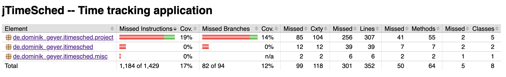
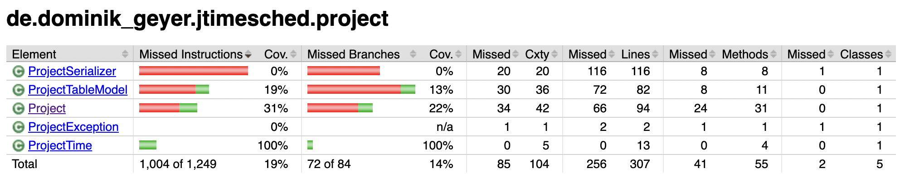
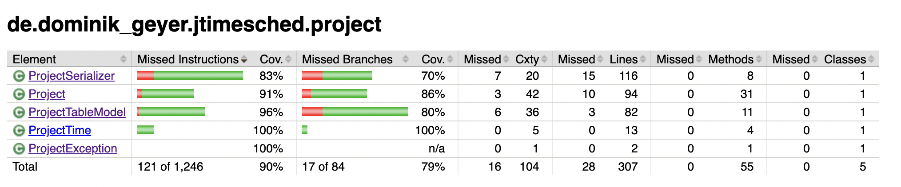
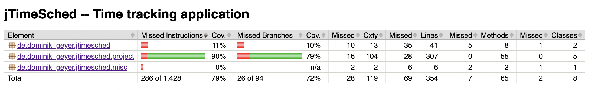

# Assignment #5

Igor Torres, Robert Metzinger
--- 11.11.2022

# Line and branch coverage of the unit tests developed in assignments #2 and #3

The project has 3 packages not related to GUI:
- de.dominik_geyer.jtimesched
- de.dominik_geyer.jtimesched.project
- de.dominik_geyer.jtimesched.misc

The `de.dominik_geyer.jtimesched.project` package has 19% coverage, while the oher two are listed with 0% coverage. That's expected since we only have tests for the `de.dominik_geyer.jtimesched.project` package.

Checking the report for the `de.dominik_geyer.jtimesched.project` package, we have 100% coverage of the `ProjectTime`. We used this class for most of the previous assignments.
We also have 31% coverage of `Project` and 19% coverage of `ProjectTableModel`, since we also used those classes for the previous assignments.

`ProjectSerializer` and `ProjectException` have 0% coverage.

# Used JUnit features

- `@ParameterizedTest` was used along with `@CsvSource` to perform multiple test cases with the same structure but varying the input parameters.
- `assertThrows` is helpful to test methods that throws exceptions without needing `try/catch` blocks. You can specify the expected exception and a lambda function that should throw the exception.
- `assertEquals` is one of the most common features, where you can compare the expected result with the actual result.
- `assertTrue` and `assertFalse` are syntactic sugar for asserting that the actual result is `true` or `false`

# Line and branch coverage after assignment #5

We implemented around 50 new test cases mainly in the `de.dominik_geyer.jtimesched.project` package. That increased the line coverage to 90% and the branch coverage to 79%.

The overall line coverage is now 79%, while the branch coverage is 72%.

During this assignment, we realized that packages with very low coverage dramatically impact the overall coverage, so it makes sense to concentrate the effort in increasing the number of tests in the less covered packages instead of seeking for 100% coverage in only one.