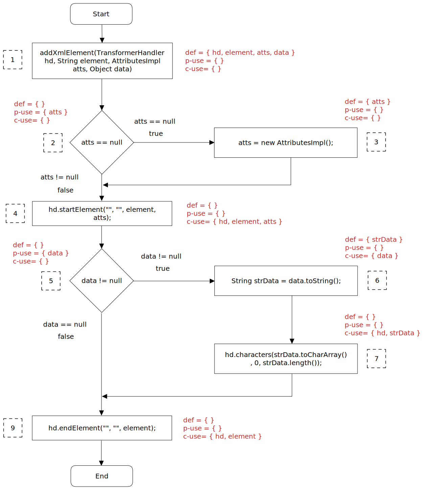
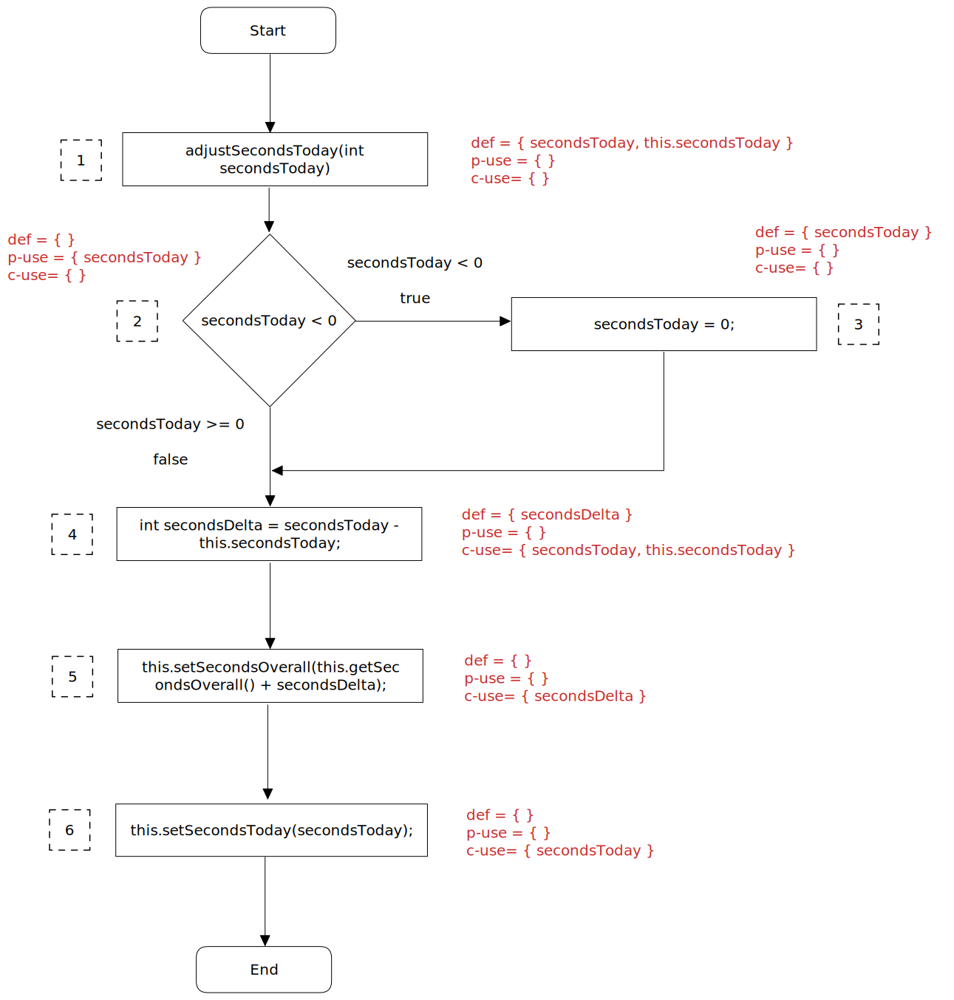

# Assignment #8

Igor Torres, Robert Metzinger
--- 02.12.2022

# function #1: ProjectTime.parseSeconds
Input parameters: String `strTime`\
Returns: int (number of seconds)

### Why this function was selected

This function was selected because it has one input parameter, several different local variables and at least one variable with multiple uses.
This makes the function interesting for dataflow testing.

### What is the purpose of this function

It converts a formatted string (H:MM:SS) to the corresponding number of seconds.
The usage of this is to make the time strings comparable and use them for calculations like the comparison between the time today and the daily quota.


### function code
```
1 public static int parseSeconds(String strTime) throws ParseException {
2 	Pattern p = Pattern.compile("(\\d+):([0-5]?\\d):([0-5]?\\d)");	// 0:00:00
3	Matcher m = p.matcher(strTime);
		 
4	if (!m.matches())
5		throw new ParseException("Invalid seconds-string", 0);
		 
6	int hours = Integer.parseInt(m.group(1));
7	int minutes = Integer.parseInt(m.group(2));
8	int seconds = Integer.parseInt(m.group(3));
		 
9	return (hours * 3600 + minutes * 60 + seconds);
10  }
```

### Variables of interest
1. `strTime` (String) = input parameter
2. `p` (Pattern)
3. `m` (Matcher)
4. `hours` (int)
5. `minutes` (int)
6. `seconds` (int)

### Dataflow graph


Fig.1: Dataflow graph of function `parseSeconds`

### Variable: `strTime`

| pair id | def | use | path    |
|---------|-----|-----|---------|
| 1       | 1   | 3   | <1,2,3> |

- all-defs pairs: 1
- all-c-uses pairs: 1
- all-p-uses pairs: -
- all-uses pairs: 1

### Variable: `p`

| pair id | def | use | path  |
|---------|-----|-----|-------|
| 1       | 2   | 3   | <2,3> |

- all-defs pairs: 1
- all-c-uses pairs: 1
- all-p-uses pairs: -
- all-uses pairs: 1

### Variable: `m`

| pair id | def | use   | path        |
|---------|-----|-------|-------------|
| 1       | 3   | 6     | <3,4,6>     |
| 2       | 3   | 7     | <3,4,6,7>   |
| 3       | 3   | 8     | <3,4,6,7,8> |
| 4       | 3   | (4,T) | <3,4,5>     |
| 5       | 3   | (4,F) | <3,4,6>     |

- all-defs pairs: 1
- all-c-uses pairs: 1,2,3
- all-p-uses pairs: 4,5
- all-uses pairs: 1,2,3,4,5

### Variable: `hours`

| pair id | def | use | path      |
|---------|-----|-----|-----------|
| 1       | 6   | 9   | <6,7,8,9> |

- all-defs pairs: 1
- all-c-uses pairs: 1
- all-p-uses pairs: -
- all-uses pairs: 1

### Variable: `minutes`

| pair id | def | use | path    |
|---------|-----|-----|---------|
| 1       | 7   | 9   | <7,8,9> |

- all-defs pairs: 1
- all-c-uses pairs: 1
- all-p-uses pairs: -
- all-uses pairs: 1

### Variable: `seconds`

| pair id | def | use | path   |
|---------|-----|-----|--------|
| 1       | 8   | 9   | <8,9>  |

- all-defs pairs: 1
- all-c-uses pairs: 1
- all-p-uses pairs: -
- all-uses pairs: 1

### All-defs pairs summary
We need to write a test set that satisfies the paths from every all-defs pair of every variable.
The required paths are:

| variable | pair id | path    |
|----------|---------|---------|
| strTime  | 1       | 1,2,3   |
| p        | 1       | 2,3     |
| m        | 1       | 3,4,6   |
| hours    | 1       | 6,7,8,9 |
| minutes  | 1       | 7,8,9   |
| seconds  | 1       | 8,9     |

### All-c-uses pairs summary
We need to write a test set that satisfies the paths from every all-c-uses pair of every variable.
The required paths are:

| variable | pair id | path      |
|----------|---------|-----------|
| strTime  | 1       | 1,2,3     |
| p        | 1       | 2,3       |
| m        | 1       | 3,4,6     |
| m        | 2       | 3,4,6,7   |
| m        | 3       | 3,4,6,7,8 |
| hours    | 1       | 6,7,8,9   |
| minutes  | 1       | 7,8,9     |
| seconds  | 1       | 8,9       |

### All-p-uses pairs summary
We need to write a test set that satisfies the paths from every all-p-uses pair of every variable.
The required paths are:

| variable | pair id | path  |
|----------|---------|-------|
| m        | 4       | 3,4,5 |
| m        | 5       | 3,4,6 |

### All-uses pairs summary
We need to write a test set that satisfies the paths from every all-uses pair of every variable.
The required paths are:

| variable | pair id | path      |
|----------|---------|-----------|
| strTime  | 1       | 1,2,3     |
| p        | 1       | 2,3       |
| m        | 1       | 3,4,6     |
| m        | 2       | 3,4,6,7   |
| m        | 3       | 3,4,6,7,8 |
| m        | 4       | 3,4,5     |
| m        | 5       | 3,4,6     |
| hours    | 1       | 6,7,8,9   |
| minutes  | 1       | 7,8,9     |
| seconds  | 1       | 8,9       |

## Unit Tests

We wrote two different test cases that cover every single required path of the coverage sections above.

test 1: `parseSecondsWithValidString` -> path: <1,2,3,4,6,7,8,9>

test 2: `parseSecondsWithInvalidString` -> path: <1,2,3,4,5>

We extend the tables from the coverage section to show which test case covers which path.

### All-defs Coverage

| variable | pair id | path    | test 1 | test 2 |
|----------|---------|---------|--------|--------|
| strTime  | 1       | 1,2,3   | x      |        |
| p        | 1       | 2,3     | x      |        |
| m        | 1       | 3,4,6   | x      |        |
| hours    | 1       | 6,7,8,9 | x      |        |
| minutes  | 1       | 7,8,9   | x      |        |
| seconds  | 1       | 8,9     | x      |        |

All-defs coverage is achieved since there is at least one def-clear-path from every definition of each variable to some corresponding use.

### All-c-uses Coverage

| variable | pair id | path      | test 1 | test 2 |
|----------|---------|-----------|--------|--------|
| strTime  | 1       | 1,2,3     | x      |        |
| p        | 1       | 2,3       | x      |        |
| m        | 1       | 3,4,6     | x      |        |
| m        | 2       | 3,4,6,7   | x      |        |
| m        | 3       | 3,4,6,7,8 | x      |        |
| hours    | 1       | 6,7,8,9   | x      |        |
| minutes  | 1       | 7,8,9     | x      |        |
| seconds  | 1       | 8,9       | x      |        |

All-c-uses coverage is achieved since there is at least one def-clear-path from every definition of each variable to every corresponding c-use.

### All-p-uses Coverage

| variable | pair id | path  | test 1 | test 2 |
|----------|---------|-------|--------|--------|
| m        | 4       | 3,4,5 |        | x      |
| m        | 5       | 3,4,6 | x      |        |

All-p-uses coverage is achieved since there is at least one def-clear-path from every definition of each variable to every corresponding p-use.
The variables `strTime`, `p`, `hours`, `minutes` and `seconds` don't have p-uses, so they don't need p-use paths.

### All-uses Coverage

| variable | pair id | path      | test 1 | test 2 |
|----------|---------|-----------|--------|--------|
| strTime  | 1       | 1,2,3     | x      |        |
| p        | 1       | 2,3       | x      |        |
| m        | 1       | 3,4,6     | x      |        |
| m        | 2       | 3,4,6,7   | x      |        |
| m        | 3       | 3,4,6,7,8 | x      |        |
| m        | 4       | 3,4,5     |        | x      |
| m        | 5       | 3,4,6     | x      |        |
| hours    | 1       | 6,7,8,9   | x      |        |
| minutes  | 1       | 7,8,9     | x      |        |
| seconds  | 1       | 8,9       | x      |        |

All-uses coverage is achieved since there is at least one def-clear-path from every definition of each variable to every corresponding use.

## Description of the unit tests

The unit tests are located in the test class ProjectTimeTest.

### parseSecondsWithValidString
We want to use a properly formatted time String as input value. So we define a variable `timeString` of type String and assign the value "1:25:36".\
We also define a variable expected of type int and assign the value 5136. This is the number of seconds corresponding to the `timeString`.\
Then we call the `parseSeconds` method with the `timeString` as input and assign its output to a variable parsed of type int.\
We assert the variables expected and parsed to be equal, so basically we expect the outcome of the `parseSeconds` call to be 5136.

Inside the `parseSeconds` method the following steps happen according to the dataflow graph in Fig.1:

1. define `strTime`: assign value "1:25:36"
2. define `p`: assign Pattern instance
3. define `m` and c-use of `p` and c-use of `strTime`: assign Matcher instance created by the `.matcher()` method of `p` with `strTime` as input parameter
4. p-use of `m`: Condition `!m.matches()` evaluates to `false` because the `strTime` value "1:25:36" does match the pattern -> `false` edge of the condition is being taken


6. define `hours` and c-use of `m`: assign number of hours (=1) derived by the `.group()` method of `m` with input 1 -> the first part of `strTime` before the first colon
7. define `minutes` and c-use of `m`: assign number of minutes (=25) derived by the `.group()` method of `m` with input 2 -> the middle part of `strTime` between the both colons
8. define `seconds` and c-use of `m`: assign number of seconds (=36) derived by the `.group()` method of `m` with input 3 -> the last part of `strTime` after the second colon
9. c-use of `hours`, `minutes` and `seconds`: calculate and return the number of total seconds (=5136) using the `hours`, `minutes` and `seconds` variables and the corresponding factors

We executed the path <1,2,3,4,6,7,8,9>.\
We asserted an integer of 5136 as outcome of the `parseSeconds` method call, which is in fact the actual outcome.\
So, our assertion was correct and the test is successful.

### parseSecondsWithInvalidString
We use `assertThrows` to test the `parseSeconds` method with an invalid time String, which is a String that does not follow the format *H:mm:ss*.\
As invalid input String we use "xyz" and we assert a `ParseException` as outcome.

Inside the `parseSeconds` method the following steps happen according to the dataflow graph in Fig.1:
1. define `strTime`: assign value "xyz"
2. define `p`: assign Pattern instance
3. define `m` and c-use of `p` and c-use of `strTime`: assign Matcher instance created by the `.matcher()` method of `p` with `strTime` as input parameter
4. p-use of `m`: Condition `!m.matches()` evaluates to `true` because the `strTime` value "xyz" does not match the pattern -> `true` edge of the condition is being taken
5. throw `ParseException` and end method execution

We executed the path <1,2,3,4,5>.\
We asserted a `ParseException`, which is in fact the actual outcome, so the test passes successfully.

# function #2: ProjectSerializer.addXmlElement
Input parameters: TransformerHandler `hd`, String `element`, AttributesImpl `atts`, Object `data`\
Returns: -

### Why this function was selected
This function was selected because it has several different input parameters, one local variable and they have different uses.
This makes the function interesting for dataflow testing.

### What is the purpose of this function
It's one step of the serialization of a project instance into XML.
In particular this function adds a new element to the project XML with the given input data.
The new element can be i.e. the project title, the associated notes, the time of creation etc.

### function code
```
1 protected static void addXmlElement(TransformerHandler hd, String element, AttributesImpl atts, Object data) throws SAXException {
2	if (atts == null)
3		atts = new AttributesImpl();
4	hd.startElement("", "", element, atts);
5	if (data != null) {
6		String strData = data.toString();
7		hd.characters(strData.toCharArray(), 0, strData.length());
8	}
9	hd.endElement("", "", element);
10 }
```

### Variables of interest
1. `hd` (TransformerHandler) = input parameter
2. `element` (String) = input parameter
3. `atts` (AttributesImpl) = input parameter
4. `data` (Object) = input parameter
5. `strData` (String)

### Dataflow graph


Fig.2: Dataflow graph of function `addXmlElement`

### Variable: `hd`

| pair id | def | use | path              |
|---------|-----|-----|-------------------|
| 1       | 1   | 4   | <1,2,3,4>         |
| 2       | 1   | 4   | <1,2,4>           |
| 3       | 1   | 7   | <1,2,3,4,5,6,7>   |
| 4       | 1   | 7   | <1,2,4,5,6,7>     |
| 5       | 1   | 9   | <1,2,3,4,5,6,7,9> |
| 6       | 1   | 9   | <1,2,4,5,6,7,9>   |
| 7       | 1   | 9   | <1,2,3,4,5,9>     |
| 8       | 1   | 9   | <1,2,4,5,9>       |

- all-defs pairs: 2
- all-c-uses pairs: 2,4,8
- all-p-uses pairs: -
- all-uses pairs: 2,4,8

### Variable: `element`

| pair id | def | use | path              |
|---------|-----|-----|-------------------|
| 1       | 1   | 4   | <1,2,3,4>         |
| 2       | 1   | 4   | <1,2,4>           |
| 3       | 1   | 9   | <1,2,3,4,5,6,7,9> |
| 4       | 1   | 9   | <1,2,4,5,6,7,9>   |
| 5       | 1   | 9   | <1,2,3,4,5,9>     |
| 6       | 1   | 9   | <1,2,4,5,9>       |

- all-defs pairs: 2
- all-c-uses pairs: 2,6
- all-p-uses pairs: -
- all-uses pairs: 2,6

### Variable: `atts`

| pair id | def | use   | path    |
|---------|-----|-------|---------|
| 1       | 1   | (2,T) | <1,2,3> |
| 2       | 1   | (2,F) | <1,2,4> |
| 3       | 1   | 4     | <1,2,4> |
| 4       | 3   | 4     | <3,4>   |

- all-defs pairs: 2,4
- all-c-uses pairs: 3,4
- all-p-uses pairs: 1,2
- all-uses pairs: 1,2,3,4

### Variable: `data`

| pair id | def | use   | path          |
|---------|-----|-------|---------------|
| 1       | 1   | (5,T) | <1,2,3,4,5,6> |
| 2       | 1   | (5,T) | <1,2,4,5,6>   |
| 3       | 1   | (5,F) | <1,2,3,4,5,9> |
| 4       | 1   | (5,F) | <1,2,4,5,9>   |
| 5       | 1   | 6     | <1,2,3,4,5,6> |
| 6       | 1   | 6     | <1,2,4,5,6>   |

- all-defs pairs: 2
- all-c-uses pairs: 6
- all-p-uses pairs: 2,4
- all-uses pairs: 2,4,6

### Variable: `strData`

| pair id | def | use | path              |
|---------|-----|-----|-------------------|
| 1       | 6   | 7   | <6,7>             |

- all-defs pairs: 1
- all-c-uses pairs: 1
- all-p-uses pairs: -
- all-uses pairs: 1

### All-defs pairs summary
We need to write a test set that satisfies the paths from every all-defs pair of every variable.
The required paths are:

| variable | pair id    | path      |
|----------|------------|-----------|
| hd       | 2          | 1,2,4     |
| element  | 2          | 1,2,4     |
| atts     | 2          | 1,2,4     |
| atts     | 4          | 3,4       |
| data     | 2          | 1,2,4,5,6 |
| strData  | 1          | 6,7       |


### All-c-uses pairs summary
We need to write a test set that satisfies the paths from every all-c-uses pair of every variable.
The required paths are:

| variable | pair id | path          |
|----------|---------|---------------|
| hd       | 2       | 1,2,4         |
| hd       | 4       | 1,2,3,4,5,6,7 |
| hd       | 8       | 1,2,4,5,9     |
| element  | 2       | 1,2,4         |
| element  | 6       | 1,2,4,5,9     |
| atts     | 3       | 1,2,4         |
| atts     | 4       | 3,4           |
| data     | 6       | 1,2,4,5,6     |
| strData  | 1       | 6,7           |

### All-p-uses pairs summary
We need to write a test set that satisfies the paths from every all-p-uses pair of every variable.
The required paths are:

| variable | pair id | path      |
|----------|---------|-----------|
| atts     | 1       | 1,2,3     |
| atts     | 2       | 1,2,4     |
| data     | 2       | 1,2,4,5,6 |
| data     | 4       | 1,2,4,5,9 |

### All-uses pairs summary
We need to write a test set that satisfies the paths from every all-uses pair of every variable.
The required paths are:

| variable | pair id | path        |
|----------|---------|-------------|
| hd       | 2       | 1,2,4       |
| hd       | 4       | 1,2,4,5,6,7 |
| hd       | 8       | 1,2,4,5,9   |
| element  | 2       | 1,2,4       |
| element  | 6       | 1,2,4,5,9   |
| atts     | 1       | 1,2,3       |
| atts     | 2       | 1,2,4       |
| atts     | 3       | 1,2,4       |
| atts     | 4       | 3,4         |
| data     | 2       | 1,2,4,5,6   |
| data     | 4       | 1,2,4,5,9   |
| data     | 6       | 1,2,4,5,6   |
| strData  | 1       | 6,7         |

## Unit tests

We wrote three different test cases that cover every single required path of the coverage sections above.

test 1: `addXmlElementAttsNotNullDataNull` -> path: <1,2,4,5,9>

test 2: `addXmlElementAttsNullDataNull` -> path: <1,2,3,4,5,9> 

test 3:`addXmlElementAttsNotNullDataNotNull` -> path: <1,2,4,5,6,7,9>

We extend the tables from the coverage section to show which test case covers which path.

### All-defs Coverage

| variable | pair id    | path      | test 1 | test 2 | test 3 |
|----------|------------|-----------|--------|--------|--------|
| hd       | 2          | 1,2,4     | x      |        |        |
| element  | 2          | 1,2,4     | x      |        |        |
| atts     | 2          | 1,2,4     | x      |        |        |
| atts     | 4          | 3,4       |        | x      |        |
| data     | 2          | 1,2,4,5,6 | x      |        |        |
| strData  | 1          | 6,7       |        |        | x      |

All-defs coverage is achieved since there is at least one def-clear-path from every definition of each variable to some corresponding use.

### All-c-uses Coverage

| variable | pair id | path          | test 1 | test 2 | test 3 |
|----------|---------|---------------|--------|--------|--------|
| hd       | 2       | 1,2,4         | x      |        |        |
| hd       | 4       | 1,2,4,5,6,7   |        |        | x      |
| hd       | 8       | 1,2,4,5,9     | x      |        |        |
| element  | 2       | 1,2,4         | x      |        |        |
| element  | 6       | 1,2,4,5,9     | x      |        |        |
| atts     | 3       | 1,2,4         | x      |        |        |
| atts     | 4       | 3,4           |        | x      |        |
| data     | 6       | 1,2,4,5,6     |        |        | x      |
| strData  | 1       | 6,7           |        |        | x      |

All-c-uses coverage is achieved since there is at least one def-clear-path from every definition of each variable to every corresponding c-use.

### All-p-uses Coverage

| variable | pair id | path      | test 1 | test 2 | test 3 |
|----------|---------|-----------|--------|--------|--------|
| atts     | 1       | 1,2,3     |        | x      |        |
| atts     | 2       | 1,2,4     | x      |        |        |
| data     | 2       | 1,2,4,5,6 |        |        | x      |
| data     | 4       | 1,2,4,5,9 | x      |        |        |

All-p-uses coverage is achieved since there is at least one def-clear-path from every definition of each variable to every corresponding p-use.
The variables `hd`, `element` and `strData` don't have p-uses, so they don't need p-use paths.

### All-uses Coverage

| variable | pair id | path        | test 1 | test 2 | test 3 |
|----------|---------|-------------|--------|--------|--------|
| hd       | 2       | 1,2,4       | x      |        |        |
| hd       | 4       | 1,2,4,5,6,7 |        |        | x      |
| hd       | 8       | 1,2,4,5,9   | x      |        |        |
| element  | 2       | 1,2,4       | x      |        |        |
| element  | 6       | 1,2,4,5,9   | x      |        |        |
| atts     | 1       | 1,2,3       |        | x      |        |
| atts     | 2       | 1,2,4       | x      |        |        |
| atts     | 3       | 1,2,4       | x      |        |        |
| atts     | 4       | 3,4         |        | x      |        |
| data     | 2       | 1,2,4,5,6   |        |        | x      |
| data     | 4       | 1,2,4,5,9   | x      |        |        |
| data     | 6       | 1,2,4,5,6   |        |        | x      |
| strData  | 1       | 6,7         |        |        | x      |

All-uses coverage is achieved since there is at least one def-clear-path from every definition of each variable to every corresponding use.

## Description of the unit tests

We created a separate class for the Unit tests: ProjectSerializerTestDataflow.\
Since we need some objects to test the function we created a setup method to initialize them.

### setup
By using the @BeforeEach annotation of junit5, this setup method runs before each test case.\
We initialize a TransformerHandler object `hd`, so first we create a new instance of SAXTransformerFactory and then use its newTransformerHandler method.\
We also need an object of the AttributesImpl class `atts`. For that we can just call its constructor.\
To inspect the outcome of our test cases we must set a Result to `hd`. 
Therefore we create ByteArrayStream `stream` and use it as input parameter for a OutputStreamWriter constructor call.
We call the OutputStreamWriter `out`. We use `out` as input parameter for a constructor call of the class StreamResult.
This StreamResult `result` we finally set as result of `hd`.

### addXmlElementAttsNotNullDataNull
We call the `addXmlElement` directly from the ProjectSerializer class since its a static method.\
We use the inputs `hd` and `atts` from our setup. As input for the parameter `element` we simply use the String "test-element".\
For this test case the `data` parameter is null.

Inside the `addXmlElement` method the following steps happen according to the dataflow graph in Fig.2:
1. define `hd`, `element`, `atts` and `data`: assign the input values
2. p-use of `atts`: Condition `atts == null` evaluates to `false` because we used the instance from the setup -> `false` edge of the condition is being taken


4. c-use of `m` and c-use of `hd`, `element` and `atts`: `startElement` method of `hd` is called with `element` and `atts` as inputs
5. p-use of `data`: Condition `data != null` evaluates to `false` because `data` is null -> `false` edge of the condition is being taken


9. c-use of `hd` and `element`: `endElement` method of `hd` is called with `element` as input

We executed the path <1,2,4,5,9>.\
To get the outcome of our test case we need to call the `flush()` method on our OutputStreamWriter `out` and call `toString()` on the ByteArrayOutputStream `stream`.\
The resulting String is used for the assertEqual, as well as the expected String "?xml version="1.0" encoding="UTF-8"?><test-element/>".\
The assertEqual is being executed successfully, which means we achieved the expected outcome.

### addXmlElementAttsNullDataNull
We call the `addXmlElement` directly from the ProjectSerializer class since its a static method.\
We use the inputs `hd` from our setup. As input for the parameter `element` we simply use the String "test-element".\
For this test case the `atts` parameter and `data` are both null.

Inside the `addXmlElement` method the following steps happen according to the dataflow graph in Fig.1:
1. define `hd`, `element`, `atts` and `data`: assign the input values
2. p-use of `atts`: Condition `atts == null` evaluates to `true` because we used the instance from the setup -> `true` edge of the condition is being taken
3. define `atts`: assign a new AttributesImpl instance.


4. c-use of `m` and c-use of `hd`, `element` and `atts`: `startElement` method of `hd` is called with `element` and `atts` as inputs
5. p-use of `data`: Condition `data != null` evaluates to `false` because `data` is null -> `false` edge of the condition is being taken


9. c-use of `hd` and `element`: `endElement` method of `hd` is called with `element` as input

We executed the path <1,2,3,4,5,9>.\
To get the outcome of our test case we need to call the `flush()` method on our OutputStreamWriter `out` and call `toString()` on the ByteArrayOutputStream `stream`.\
The resulting String is used for the assertEqual, as well as the expected String "?xml version="1.0" encoding="UTF-8"?><test-element/>".\
The assertEqual is being executed successfully, which means we achieved the expected outcome.

### addXmlElementAttsNotNullDataNotNull
We call the `addXmlElement` directly from the ProjectSerializer class since its a static method.\
We use the inputs `hd` from our setup. As input for the parameter `element` we simply use the String "test-element".\
For this test case the `atts` parameter is null. The `data` parameter for this test case is a String with the value "test-data".

Inside the `addXmlElement` method the following steps happen according to the dataflow graph in Fig.2:
1. define `hd`, `element`, `atts` and `data`: assign the input values
2. p-use of `atts`: Condition `atts == null` evaluates to `true` because we used the instance from the setup -> `true` edge of the condition is being taken


4. c-use of `m` and c-use of `hd`, `element` and `atts`: `startElement` method of `hd` is called with `element` and `atts` as inputs
5. p-use of `data`: Condition `data != null` evaluates to `false` because `data` is null -> `false` edge of the condition is being taken
6. define `strData` and c-use of `data`: call the `.toString()` method on `data` and assign it to the new String `strData`.
7. c-use of `hd` and `strData`: call the `.characters` method with `strData.toCharArray()` and `strData.length()` as inputs


9. c-use of `hd` and `element`: `endElement` method of `hd` is called with `element` as input

We executed the path <1,2,4,5,6,7,9>.\
To get the outcome of our test case we need to call the `flush()` method on our OutputStreamWriter `out` and call `toString()` on the ByteArrayOutputStream `stream`.\
The resulting String is used for the assertEqual, as well as the expected String "<?xml version="1.0" encoding="UTF-8"?><test-element>test-data</test-element>".\
The assertEqual is being executed successfully, which means we achieved the expected outcome.


# function #3: Project.adjustSeconds
Input parameters: int `secondsToday`\
Class attributes: int `this.secondsToday`\
Returns: -

### Why this function was selected
This function was selected because it has a different number and types of variables than the other functions.\
It has multiple variable definitions as well as some different uses.\
This makes the function interesting for dataflow testing.

### What is the purpose of this function
This function is used to update the project's time today and time overall when the user manually sets a value for the time today.

### function code
```
1 public void adjustSecondsToday(int secondsToday) {
2	if (secondsToday < 0)
3		secondsToday = 0;
		
4	int secondsDelta = secondsToday - this.secondsToday;
		
5	this.setSecondsOverall(this.getSecondsOverall() + secondsDelta);
6	this.setSecondsToday(secondsToday);
7 }
```

### Variables of interest
1. `secondsToday` (int) = input parameter
2. `secondsDelta` (int)
3. `this.secondsToday` = class attribute

### Dataflow graph


Fig.3: Dataflow graph of function `adjustSecondsToday`

### Variable: `secondsToday`

| pair id | def | use   | path          |
|---------|-----|-------|---------------|
| 1       | 1   | (2,T) | <1,2,3>       |
| 2       | 1   | (2,F) | <1,2,4>       |
| 3       | 1   | 4     | <1,2,4>       |
| 4       | 1   | 6     | <1,2,4,5,6>   |
| 5       | 3   | 4     | <3,4>         |
| 6       | 3   | 6     | <3,4,5,6>     |

- all-defs pairs: 1,5
- all-c-uses pairs: 3,4,5,6
- all-p-uses pairs: 1,2
- all-uses pairs: 1,2,3,4,5,6

### Variable: `secondsDelta`

| pair id | def | use   | path          |
|---------|-----|-------|---------------|
| 1       | 4   | 5     | <4,5>         |

- all-defs pairs: 1
- all-c-uses pairs: 1
- all-p-uses pairs: -
- all-uses pairs: 1

### Variable: `this.secondsToday`

| pair id | def | use | path      |
|---------|-----|-----|-----------|
| 1       | 1   | 4   | <1,2,3,4> |
| 2       | 1   | 4   | <1,2,4>   |

- all-defs pairs: 2
- all-c-uses pairs: 2
- all-p-uses pairs: -
- all-uses pairs: 2

### All-defs pairs summary
We need to write a test set that satisfies the paths from every all-defs pair of every variable.
The required paths are:

| variable          | pair id | path   |
|-------------------|---------|--------|
| secondsToday      | 1       | 1,2,3  |
| secondsToday      | 5       | 3,4    |
| secondsDelta      | 1       | 4,5    |
| this.secondsToday | 2       | 1,2,4  |


### All-c-uses pairs summary
We need to write a test set that satisfies the paths from every all-c-uses pair of every variable.
The required paths are:

| variable          | pair id | path      |
|-------------------|---------|-----------|
| secondsToday      | 3       | 1,2,4     |
| secondsToday      | 4       | 1,2,4,5,6 |
| secondsToday      | 5       | 3,4       |
| secondsToday      | 6       | 3,4,5,6   |
| secondsDelta      | 1       | 4,5       |
| this.secondsToday | 2       | 1,2,4     |

### All-p-uses pairs summary
We need to write a test set that satisfies the paths from every all-p-uses pair of every variable.
The required paths are:

| variable          | pair id | path    |
|-------------------|---------|---------|
| secondsToday      | 1       | 1,2,3   |
| secondsToday      | 2       | 1,2,4   |

### All-uses pairs summary
We need to write a test set that satisfies the paths from every all-uses pair of every variable.
The required paths are:

| variable          | pair id | path      |
|-------------------|---------|-----------|
| secondsToday      | 1       | 1,2,3     |
| secondsToday      | 2       | 1,2,4     |
| secondsToday      | 3       | 1,2,4     |
| secondsToday      | 4       | 1,2,4,5,6 |
| secondsToday      | 5       | 3,4       |
| secondsToday      | 6       | 3,4,5,6   |
| secondsDelta      | 1       | 4,5       |
| this.secondsToday | 2       | 1,2,4     |

## Unit tests
We wrote two different test cases that cover every single required path of the coverage sections above.

test 1: `adjustSecondsToday` -> path: <1,2,4,5,6>

test 2: `adjustSecondsTodayNegative` -> path: <1,2,3,4,5,6>

We extend the tables from the coverage section to show which test case covers which path.

### All-defs Coverage

| variable          | pair id | path   | test 1 | test 2 |
|-------------------|---------|--------|--------|--------|
| secondsToday      | 1       | 1,2,3  |        | x      |
| secondsToday      | 5       | 3,4    |        | x      |
| secondsDelta      | 1       | 4,5    | x      |        |
| this.secondsToday | 2       | 1,2,4  | x      |        |

All-defs coverage is achieved since there is at least one def-clear-path from every definition of each variable to some corresponding use.

### All-c-uses Coverage

| variable          | pair id | path      | test 1 | test 2 |
|-------------------|---------|-----------|--------|--------|
| secondsToday      | 3       | 1,2,4     | x      |        |
| secondsToday      | 4       | 1,2,4,5,6 | x      |        |
| secondsToday      | 5       | 3,4       |        | x      |
| secondsToday      | 6       | 3,4,5,6   |        | x      |
| secondsDelta      | 1       | 4,5       | x      |        |
| this.secondsToday | 2       | 1,2,4     | x      |        |

All-c-uses coverage is achieved since there is at least one def-clear-path from every definition of each variable to every corresponding c-use.

### All-p-uses Coverage

| variable          | pair id | path    | test 1 | test 2 |
|-------------------|---------|---------|--------|--------|
| secondsToday      | 1       | 1,2,3   |        | x      |
| secondsToday      | 2       | 1,2,4   | x      |        |

All-p-uses coverage is achieved since there is at least one def-clear-path from every definition of each variable to every corresponding p-use.
The variable `secondsDelta` doesn't have p-uses, so it needs no p-use paths.

### All-uses Coverage

| variable          | pair id | path      | test 1 | test 2 |
|-------------------|---------|-----------|--------|--------|
| secondsToday      | 1       | 1,2,3     |        | x      |
| secondsToday      | 2       | 1,2,4     | x      |        |
| secondsToday      | 3       | 1,2,4     | x      |        |
| secondsToday      | 4       | 1,2,4,5,6 | x      |        |
| secondsToday      | 5       | 3,4       |        | x      |
| secondsToday      | 6       | 3,4,5,6   |        | x      |
| secondsDelta      | 1       | 4,5       | x      |        |
| this.secondsToday | 2       | 1,2,4     | x      |        |

All-uses coverage is achieved since there is at least one def-clear-path from every definition of each variable to every corresponding use.

## Description of the unit tests

The unit tests are located in the test class ProjectTest.
Since we need a test project for each test, we created a setup to initialize one.

### setup
By using the @BeforeEach annotation of junit5, this setup method runs before each test case.\
We initialize a new project instance by calling the constructor of the class Project with the String "test" as input for the title parameter.
We call this project instance `testProject`.

### adjustSecondsToday
First we use the `setSecondsOverall` method of `testProject` to set the secondsOverall to 100.\
Second we use the `setSecondsToday` method of `testProject` to set the secondsToday to 50.\
Now we call the `adjustSecondsToday` method with the value 40 as input for `secondsToday`.

Inside the `adjustSecondsToday` method the following steps happen according to the dataflow graph in Fig.3:
1. define `secondsToday`: assign the value 40.
2. p-use of `secondsToday`: Condition `secondsToday < 0` evaluates to `false` because 40 >= 0 -> `false` edge of the condition is being taken


4. def of `secondsDelta` and c-use of `secondsToday`: assign the difference of `secondsToday` (40) and the current value (50) of secondsToday, so the value of `secondsDelta` is -10.
5. c-use of `secondsDelta`: call the method `setSecondsOverall` with the sum of the project's current value (100) of secondsOverall and `secondsDelta` (-10) as input, so we set the secondsOverall value to 90.
6. c-use of `secondsToday`: call the method `setSecondsToday` with `secondsToday` as input.

We executed the path <1,2,4,5,6>.\
We want to check the `testProject`'s _secondsToday_ property and _secondsOverall_ property.\
We use assertEquals with an expected value of 90 and the value we receive from the `testProject`'s getSecondsOverall method.\
We use assertEquals with an expected value of 40 and the value we receive from the `testProject`'s getSecondsToday method.\
Both assertEquals are being executed successfully, which means we achieved the expected outcome.

### adjustSecondsTodayNegative
First we use the `setSecondsOverall` method of `testProject` to set the secondsOverall to 100.\
Second we use the `setSecondsToday` method of `testProject` to set the secondsToday to 50.\
Now we call the `adjustSecondsToday` method with the value -1 as input for `secondsToday`.

Inside the `adjustSecondsToday` method the following steps happen according to the dataflow graph in Fig.3:
1. define `secondsToday`: assign the value -1
2. p-use of `secondsToday`: Condition `secondsToday < 0` evaluates to `true` because -1 < 0 -> `true` edge of the condition is being taken
3. define `secondsToday`: assign the value 0
4. def of `secondsDelta` and c-use of `secondsToday`: assign the difference of `secondsToday` (0) and the current value (50) of secondsToday, so the value of `secondsDelta` is -50.
5. c-use of `secondsDelta`: call the method `setSecondsOverall` with the sum of the project's current value (100) of secondsOverall and `secondsDelta` (-50) as input, so we set the secondsOverall value to 50.
6. c-use of `secondsToday`: call the method `setSecondsToday` with `secondsToday` as input.

We executed the path <1,2,3,4,5,6>.\
We want to check the `testproject`'s _secondsToday_ property and _secondsOverall_ property.\
We use assertEquals with an expected value of 50 and the value we receive from the `testProject`'s getSecondsOverall method.\
We use assertEquals with an expected value of 0 and the value we receive from the `testProject`'s getSecondsToday method.\
Both assertEquals are being executed successfully, which means we achieved the expected outcome.
