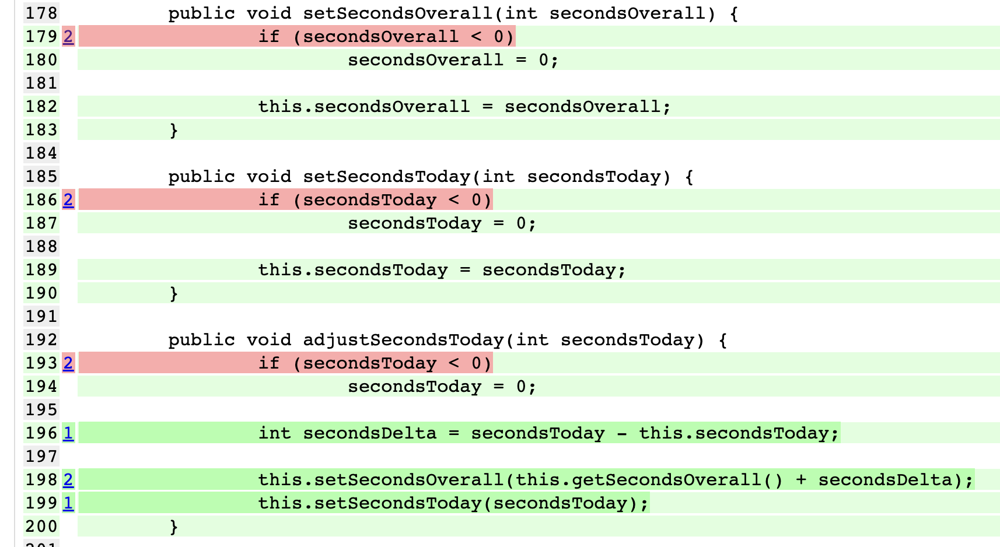
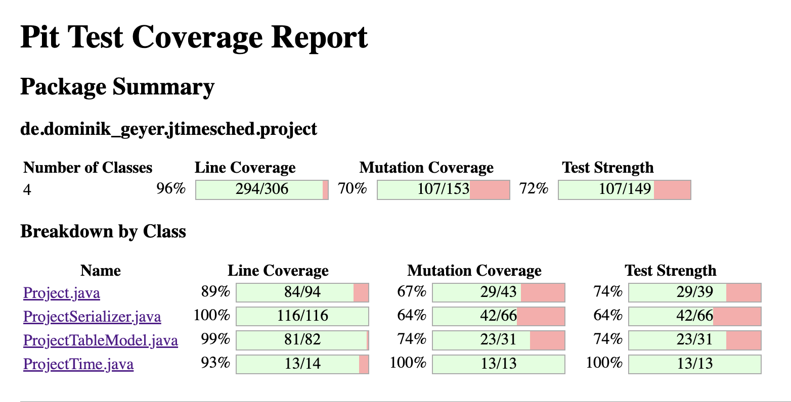

# Assignment #9

Igor Torres, Robert Metzinger
--- 09.12.2022

# Mutation coverage of the unit tests developed in previous assignments

The initial Pit Test Coverage Report reveals that we have 63% of mutation coverage and 69% of test strength.
Moreover, 14 mutations were not covered by any test cases. Those are the same lines that we did not cover in the previous assignments.

Taking a look at the report split by class, we can identify that the `ProjectTime` class has 100% mutation coverage, so we don't need to work more on the tests of this class.
But on the contrary, we have only 50% of coverage in the `ProjectSerializer`, so it's a good idea to improve the test cases of this class.

Both `Project` and `ProjectTableModel` have a good amount of mutants that were covered by tests, but they survived. So there's room to improve the tests that we already have or develop new ones to target the same lines and kill the mutations.

# Equivalent mutants

In the lines 179, 186 and 193 we have similar blocks of code when we verify if the parameter is lower than zero.
The survived mutants are "changed conditional boundary".
Our test cases were testing a large number (as 1000) and a negative number (-1).

The target of the test is: negative numbers should be 0 and positive numbers should remain themselves.
If the boundary is changed to a negative number, the test cases with -1 would break.
If the boundary is changed to a positive number greater than 1, a test case with the value 1 would break.
But if the boundary is changed to 1, there is no way to break the test, because the only number that would enter in the "if condition" would be 0, but that does not break the test case.

We tried all the options described above and the mutants are still surviving, so we guess that it is using 1 as the boundary, making those equivalent mutants.

In the `ProjectSerializer`, most of the surviving mutants are related with project attributes that we are actually not using in the tests, so the mutants just removed those lines. 
None of them are equivalent mutants.

In the `ProjectTableModel` there is one mutant about the logged information, that I think it's not worth to test, but it's not an equivalent mutant.

So there is no equivalent mutants in the report.

# Description of test cases developed to increase project’s mutation coverage

After developing a few more test cases, the mutation coverage was increased to 70%, killing 11 more mutants.

## `ProjectSerializer`
Many mutants were about removed calls of attributes that we were not exercising.
So we improved the `xml` test to define all possible attributes of a project.
Now, when Pit Test removes the call of those functions, the test breaks.

We also added 3 more test cases to exercise other mutants of same lines.

That way, we killed 9 more mutants.

## `ProjectTableModel`

We developed test cases to address conditions that were not being covered.
