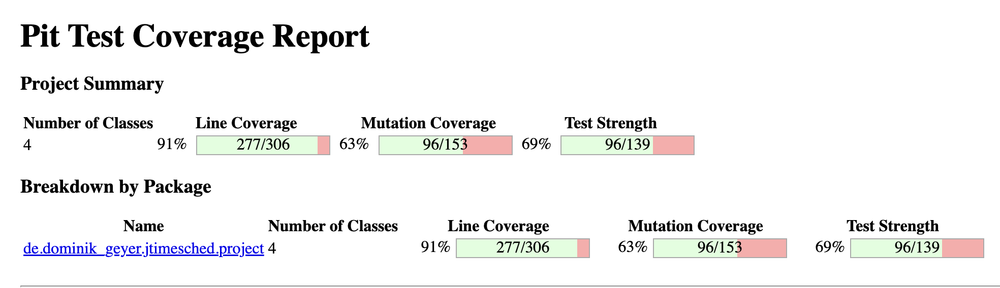
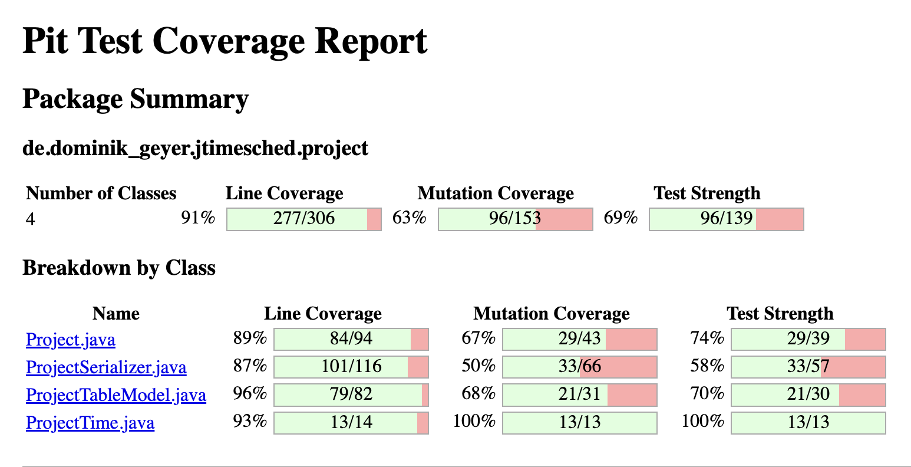

# Assignment #9

Igor Torres, Robert Metzinger
--- 09.12.2022

# Mutation coverage of the unit tests developed in previous assignments

The initial Pit Test Coverage Report reveals that we have 63% of mutation coverage and 69% of test strength.
Moreover, 14 mutations were not covered by any test cases. Those are the same lines that we did not cover in the previous assignments.

Taking a look at the report split by class, we can identify that the `ProjectTime` class has 100% mutation coverage, so we don't need to work more on the tests of this class.
But on the contrary, we have only 50% of coverage in the `ProjectSerializer`, so it's a good idea to improve the test cases of this class.

Both `Project` and `ProjectTableModel` have a good amount of mutants that were covered by tests, but they survived. So there's room to improve the tests that we already have or develop new ones to target the same lines and kill the mutations.

# Equivalent mutants

There are no equivalent mutants in the `Project` class. Most of the surviving mutants are related with `getElapsedSeconds`, that we actually don't have tests.

In the `ProjectSerializer`, most of the surviving mutants are related with project attributes that we are actually not using in the tests, so the mutants just removed those lines. 
None of them are equivalent mutants.

In the `ProjectTableModel` there is one mutant about the logged information, that I think it's not worth to test, but it's not an equivalent mutant.

So there is no equivalent mutants in the report.

# Description of test cases developed to increase project’s mutation coverage

